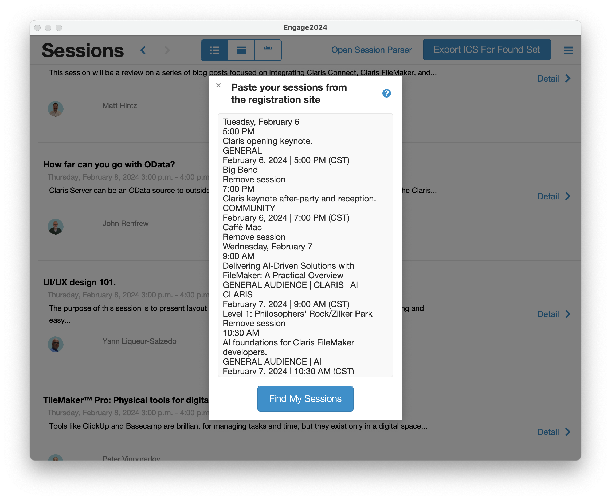
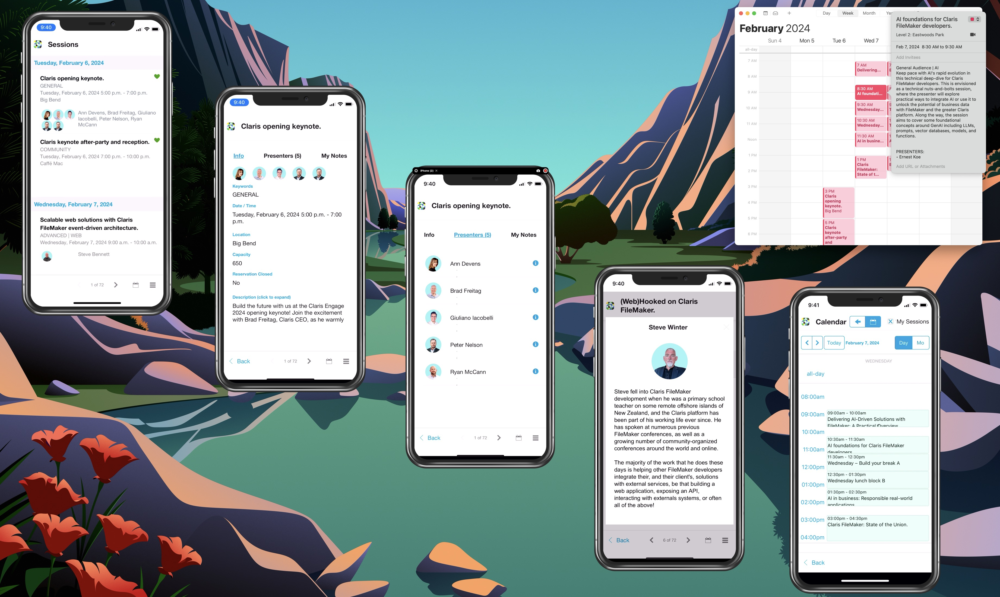

# Claris Engage 2024

**UPDATE: this app is for a bygone Claris Engage Conference. Maybe it can be revived and improved later, but for now, this project is finished**

This does two things:

1. iCal Generator
2. Serves as an offline Desktop/iPhone App (FileMaker Pro/Go)

## Usage

### iCal Generator

1. Go to your Claris Engage schedule
2. filter to show only your registed sessions
3. highlight and copy all your sessions (including the date section headers is fine)
4. paste into the ical parser in this app
5. Optionally uses the hamburger menu to mark the found set as "registered"
6. Click "Export ICS for Found Set"
7. Open the ics file and save to your calendar app!

### FileMaker Pro/Go App

1. Open the app in FileMaker Pro or Go
2. Look at it

### Updating session data

1. Open menu in app and click the update button to query the "database" (private github gist)
2. if available, download updated json
3. don't worry your registrations won't be lost

### Updating the whole app

1. rename your old file Engage2024old.fmp12 and leave in the same directory
2. download the new version from github
3. move the new one to the same directory as the old and open
4. run the "import registrations from old file" command from menu
5. check for json updates from the menu.

## License

This is open source and you can use it for whatever you want. The author makes no guarantees about it's functionality or accuracy. It's just a fun little project.
